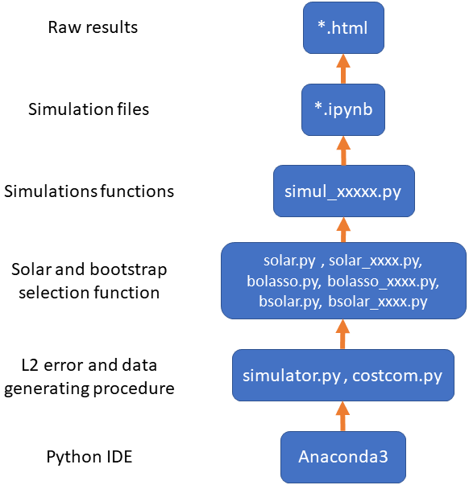

<h1>Python package "solarpy"</h1>

<h3>created at Jan/20/2019</h3>

<h3>last updated at Apr/20/2022</h3>

 

### The corresponding paper can be found at https://arxiv.org/abs/2007.15707.

 

### A detailed video walkthrough can be found at .

 

### #0. This Github repository includes
>  the detailed explanations and comments of each file can be found in the README file or "READEME.pdf" in each folder.

* folder "raw_results": 
  >all the raw results of simulations and examples, with detailed explanations;
* folder "example_test":
  > the simluation for <u>the example of post-selection testing</u>;
* folder "example_IRC":
  > the simulation for <u>the IRC Example</u>.
* folder "simul_lasso_solar":
  > the simulation for <u>the lasso-solar comparison</u>;
* folder "simul_bolasso_bsolar":
  > the simulation for <u>the bootstrap selection comparison</u>;
* folder "application":
  > the real-world application;
* folder "demo":
  > the step-by-step walkthrough of <u>Python packages "bolasso", "solar" and "bsolar.py"</u>. 

#### to quickly verify the paper results, all raw results are saved as HTML files in the "raw_results" folder with detailed comments and explanations.

 

### #1. This package is programmed based on the following flow.

  

*  we program the function for L2 error and data generating procedure based on the functions from Anaconda3 (an easy-to-use Python enviroment)

* based on the function above, we define the function of solar, bolasso, and bootstrap solar function.

* based on the function above, we define the functions for plotting and calculation in simulations

* based on the function above, we conduct all simulations in ipynb files and save the raw result of simluations as HTML.

 

### #2. Remarks

#### About the Python and iPython codes

*  This package 
  * was originally developed at Jan 2019 on Ubuntu 18.04 using Anaconda3 version 2019-03 (under the Intel MKL C++/Fortran library).
  
  * passes the unit test on Ubuntu 20.04 using Anaconda3 version 2021-04 (under the Intel MKL C++/Fortran library).

* In each ".py" and ".ipynb" file I carefully and thoroughly explain
  * the meaning of every step;
  * the meaning of inputs and output;
  * the purpose of each function;
  * how each step corresponds to the paper.

* the simulations and examples are done in ".ipynb" files;

* all the ".py" files only contain the supporting function for simulations and examples.

* at the end of each ".py" file, I add a testing module for debug. You can simple run each ".py" file at terminal using "python" or "python3" command. If no bug are reported, the package is bug-free.

* The Python files automatically export the raw simulation/example results as ".html" files, which can be found at the "./raw_results" folder; the numerical results are automatically saved as ".p" files at the "numerical_result" subfolder at each simulation folder.

#### About replication

*  To replicate the simulation **after you read though the detailed explanation and comments in each ".ipynb" file**, you just need to
  * open each ".ipynb" file in <u>Jupyter Lab (or Jupyter notebook)</u>,
  * click the <u>"Kernel"</u> menu
  * click <u>"Restart Kernel and Run All Cells"</u>.
  * **you may want to read the comments in ".ipynb" files carefully before you replicate bolasso simulations (since it could take very long time).**
    
